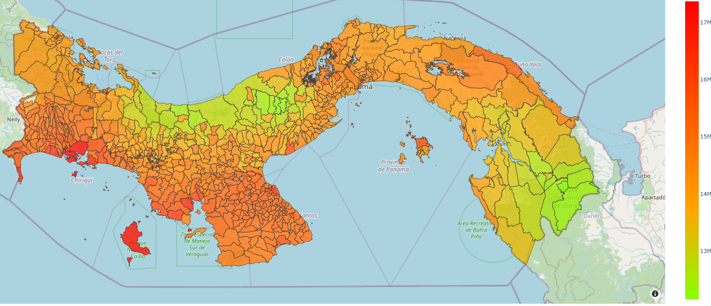
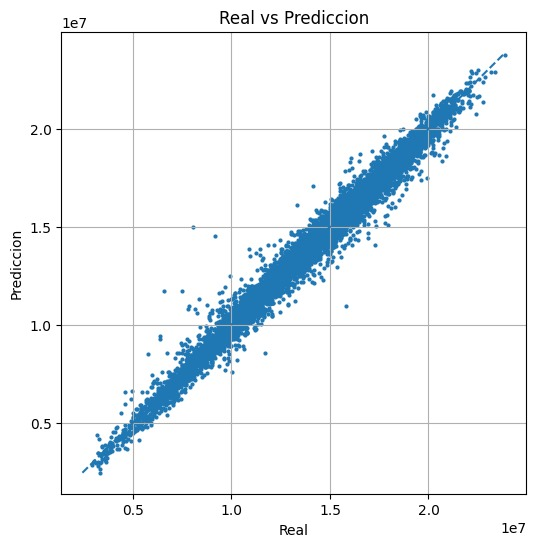

# Modelo de red neuronal para la predicción de radiación solar en Panamá usando variables climáticas (MRNS)

> **Actualización Hackathon SIC 2025:** Este proyecto ha sido actualizado para integrar conexión en tiempo real con satélites y predicción en vivo.

**MRNS** es una aplicación de escritorio desarrollada en **Python** cuyo objetivo principal es predecir la radiación solar neta en Panamá a nivel de corregimiento y coordenadas específicas, utilizando datos climáticos procesados por una Red Neuronal (NN).

---

## Descripción General

El proyecto aborda la pregunta clave: **"¿Cómo afecta el clima a la generación de paneles solares?"**

Para responder a esto, el sistema se enfoca en:
1.  **Mapear** todo el país con datos climáticos por coordenadas.
2.  Utilizar un **modelo de Red Neuronal** entrenado para predecir la radiación solar neta (variable clave para la generación de energía fotovoltaica).
3.  **Visualizar** los resultados a nivel de corregimiento en un mapa interactivo.

La aplicación integra la visualización de los resultados del modelo con una interfaz moderna y funcionalidades de predicción por punto geográfico.

---



## ⚙️ Instalación y Requisitos

Para ejecutar **MRNS** en tu entorno local, sigue estos pasos:

### Prerrequisitos
* **Python 3.10** o superior.
* **Git** instalado.
* Credenciales de Google Earth Engine (Archivo JSON de cuenta de servicio).

### Pasos de Instalación

1.  **Clonar el repositorio:**
    ```bash
    git clone [https://github.com/fundestddelgado/PA12-KOINTROL.IA-PROYECTO-FINAL.git](https://github.com/fundestddelgado/PA12-KOINTROL.IA-PROYECTO-FINAL.git)
    cd PA12-KOINTROL.IA-PROYECTO-FINAL
    ```

2.  **Crear y activar un entorno virtual (Recomendado):**
    ```bash
    # En Windows
    python -m venv venv
    .\venv\Scripts\activate

    # En macOS/Linux
    python3 -m venv venv
    source venv/bin/activate
    ```

3.  **Instalar dependencias:**
    ```bash
    pip install -r requirements.txt
    ```

4.  **Configurar Credenciales de Google Earth Engine:**
    * Este proyecto requiere una llave de cuenta de servicio (`.json`) para acceder a la API de GEE.
    * Coloca tu archivo de credenciales (ej. `kointrol-ai-xxxx.json`) en la carpeta `Hackaton_SIC_2025/modulos_gee/`.
    * *Nota: Asegúrate de que el nombre del archivo coincida con el especificado en `modulos_gee.py` o actualiza la ruta en el código.*

### 🚀 Ejecución

Para iniciar la aplicación, ejecuta el siguiente comando desde la raíz del proyecto:

```bash
python Hackaton_SIC_2025/interfaz.py


## Arquitectura y Flujo de Datos

El proyecto se estructura en tres fases principales: **Datos**, **Modelo** e **Interfaz**.

## Recopilación y Variables del Estudio

### 1. Recopilación y Procesamiento de Datos

* **Fuente de Datos:** La información climática se recopiló utilizando **Google Earth Engine** (Dataset AgEra5 para entrenamiento y ERA5-Land para consultas en tiempo real).
* **Volumen:** Se integró un *dataset* histórico de **128,000 puntos de datos**.
* **Procesamiento:** Los datos fueron procesados, limpiados e integrados utilizando coordenadas de latitud y longitud.

---

### Variables Utilizadas en el Estudio

Las siguientes variables climáticas fueron extraídas, procesadas y utilizadas como *features* (características) para el análisis y modelado del estudio.

| Variable | Tipo de Dato | Propósito |
| :--- | :--- | :--- |
| **date** | Categórica (Fecha) | Permite la indexación y el análisis temporal. |
| **lon / lat** | Numérica | Define la ubicación espacial. |
| **elevation** | Numérica (Metros) | Representa la altitud, influye en temperatura y presión. |
| **Cloud_Cover_Mean_24h** | Numérica (Fracción) | Mide la nubosidad promedio (factor crítico). |
| **Temperature_Air_2m** | Numérica (Kelvin/C) | Temperatura del aire a 2m. |
| **relative_humidity** | Numérica (%) | Cantidad de vapor de agua en el aire. |
| **surface_pressure** | Numérica (Pascal) | Presión en la superficie terrestre. |
| **total_precipitation** | Numérica (Metros) | Cantidad acumulada de lluvia. |
| **surface_net_solar_radiation (target)** | Numérica ($J/m^2$) | **Variable objetivo**: Energía solar neta recibida. |

---

### 2. Modelo de Red Neuronal (NN)

Se utilizó **TensorFlow/Keras** para construir y entrenar una Red Neuronal densa.

* **Arquitectura del Modelo:**

| Capa / Bloque | Tipo de Capa | Unidades | Detalles |
| :--- | :--- | :--- | :--- |
| **Inicial** | `Dense` + `BatchNorm` | 128 | Entrada escalada |
| **Bloque 1** | `Dense` + `BatchNorm` + `Dropout` | 256 | Regularización L2 |
| **Bloque 2** | `Dense` + `BatchNorm` | 256 | Activación GELU |
| **Bloque 3** | `Dense` + `BatchNorm` + `Dropout` | 128 | Dropout (0.05) |
| **Salida** | `Dense` | 1 | Predicción Lineal |

* **Métricas de Rendimiento (Validación):**
    * **R² (Coeficiente de Determinación):** 0.9806
    * **MAPE:** 32.41%


---

### 3. Interfaz de Usuario (UI) y Visualización

La aplicación utiliza **Tkinter** para la interfaz de escritorio, organizada en pestañas.

* **Pestaña 1: Mapa por Corregimiento**
    * Utiliza **Plotly Express** y **GeoPandas** para generar un mapa interactivo de Panamá.
    * El mapa se abre en un navegador web o visor externo para garantizar interactividad completa (zoom, hover).

* **Pestaña 2: Predictor por Coordenadas (Actualización Hackathon)**
    * **Funcionalidad:** Permite ingresar coordenadas o seleccionar Provincia/Corregimiento.
    * **Backend:** Conecta en tiempo real a la API de Google Earth Engine.
    * **Proceso:** Extrae las condiciones climáticas de los últimos 20 días para el punto seleccionado, las procesa y alimenta el modelo neuronal.
    * **Resultado:** Muestra la radiación predicha por la IA y la compara con el dato real satelital para validar la precisión.

---

## Estructura y Módulos Principales

El proyecto sigue una estructura modular:

* **`interfaz.py`** → Control central de la aplicación (Tkinter).
* **`Hackaton_SIC_2025/`** → Módulos nuevos de conexión en tiempo real.
    * **`modulos_gee.py`** → Conexión con API de Google Earth Engine.
    * **`feature_generator.py`** → Ingeniería de características en vivo.
* **`Visualization/`** → Generación de mapas y manejo de GeoJSON.
* **`Models/`** → Archivos del modelo (`.keras`) y escaladores (`.pkl`).

---

## Librerías Utilizadas

| Librería | Función Principal |
| :--- | :--- |
| **tkinter** | Interfaz gráfica de escritorio |
| **earthengine-api** | Conexión satelital (Hackathon) |
| **pandas / geopandas** | Manejo de datos y operaciones espaciales |
| **plotly** | Mapas interactivos |
| **tensorflow** | Inferencia del modelo de Red Neuronal |
| **scikit-learn** | Escalado de datos (StandardScaler) |

---

## Equipo de Desarrollo (SIC 2025 - PA12)

| Nombre | Rol o Función |
| :--- | :--- |
| **Alan Sánchez** | Líder de Proyecto / Desarrollador Principal (Modelo NN y UI) |
| **Abdiel Bernal** | Desarrollador de Visualización de Datos (Mapeo GeoPandas/Plotly) |
| **Ernesto Jurado** | Desarrollador de la Interfaz de Usuario (Tkinter/Funcionalidades Predictor) |
| **Ana Flores** | Desarrolladora de la Base de Datos y Documentación (Procesamiento de Datos) |

---

## Créditos

Proyecto desarrollado como parte del programa **Samsung Innovation Campus (SIC) 2025** - Región de Panamá.